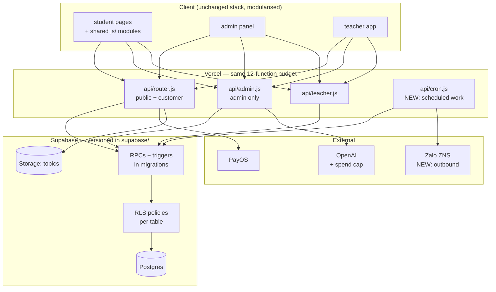

# Architecture — target state and migration plan

Companion to [`ARCHITECTURE.md`](ARCHITECTURE.md), which describes the system as it exists.
This document states where it should go, in what order, and what is explicitly **not** being
changed.

## Design position

The current stack is not the problem. Static pages plus serverless functions plus Postgres is
a sound choice for this product: one venue, a few hundred students, a booking flow whose
correctness lives in the database. A rewrite into a framework would replace working payment
logic with new bugs and buy nothing a customer can perceive.

**The problem is that the system has no verifiable foundation.** The database is invisible to
version control, authorization has no backstop, nothing runs on a schedule, and no change can
be validated before it reaches paying customers.

So the plan is deliberately conservative:

- **Keep**: Vercel serverless, Supabase Postgres + Storage, PayOS, business logic in RPCs,
  vanilla-JS frontends, the `router.js` multiplexing pattern.
- **Fix**: the database becomes code, RLS becomes the authorization backstop, scheduled work
  becomes real, identity gets a second factor, staging exists.
- **Refactor later, only where it pays**: split `index.html`, split `api/admin.js`.
- **Not doing**: no React/Next migration, no ORM, no microservices, no Kubernetes, no
  multi-region. If a phase does not reduce a named risk, it is not in this plan.

## Target architecture

Four structural additions, nothing removed:

| Addition | Replaces | Removes the risk that |
|---|---|---|
| `supabase/` migrations | dashboard-only edits | nobody can review or roll back the logic that prices a booking |
| RLS policies | JS-only checks | one missing filter exposes every customer |
| `api/cron.js` + `vercel.json` `crons` | client heartbeats, manual work | holds leak, reminders never send, recurring classes never appear |
| Outbound messaging module | nothing | the product cannot reach a student who closed the tab |

## Target authentication model

| Surface | Today | Target |
|---|---|---|
| Student | phone only, perpetual `device_token` | phone + OTP (Zalo ZNS), rotating token with expiry + revocation, hashed at rest |
| Admin | one shared password | per-admin accounts, 2FA, rate limit, audit log |
| Teacher | username + password, RPC-verified | unchanged mechanism, dedicated required secret, password reset flow |
| Database | service-role everywhere | request-scoped key for student reads under RLS; service-role only for privileged paths |
| Files | 10-min signed URL | unchanged (adequate) |

## Migration phases

Each phase is independently shippable and ordered by risk reduction per unit of effort.
Phase 0 blocks everything else.

### Phase 0 — Make the system knowable *(blocks all other work)*

- Dump the Supabase schema into `supabase/schema.sql`, then split into ordered migrations.
- Document every RPC signature and its thrown error codes.
- Stand up a **staging** Supabase project plus a Vercel preview environment with its own keys.
- Seed script so a database can be created from nothing.

*Exit criterion:* a new developer runs the product locally against staging without asking
anyone for anything but credentials.

### Phase 1 — Stop the bleeding *(security and money)*

- Record a placement attempt at transcription time; bind quota to a server-issued identity;
  add a bot check for guest tests; set a hard OpenAI spend ceiling.
- Delete `api/vocabulary.js`.
- Rate-limit `bookings/create`, `customers/login`, `admin?action=login`, `track-visit`.
- Constant-time admin password comparison; lockout and alerting on repeated failure.
- Remove PII from log statements.
- Require `SPEAKHUB_TEACHER_SECRET`; fail closed instead of falling back.

*Exit criterion:* no unauthenticated endpoint can spend money or enumerate customers.

### Phase 2 — Real identity

- OTP challenge over Zalo ZNS with TTL, attempt cap and per-phone rate limit.
- Rotate `device_token` on login and logout; store only a hash; expose revocation.
- Move progress-test answer keys server-side; issue an attempt id at test start.

*Exit criterion:* knowing a phone number grants nothing.

### Phase 3 — Authorization backstop

- Enable RLS on all 22 tables and write policies expressing the real rules.
- Convert student-facing reads to a request-scoped client; keep service-role for privileged
  paths only.
- Regression check: student A's credentials return zero of student B's rows even with the
  handler filter removed.

*Exit criterion:* a single missing JS check is no longer a data breach.

### Phase 4 — Scheduled execution

- `api/cron.js` with `vercel.json` `crons`: expire stale holds, materialise recurring
  sessions, emit T-24h class reminders, sweep abandoned PENDING orders.
- Emit `session_events` from every session mutation so notifications work.
- Outbound messaging module with templates and delivery logging.

*Exit criterion:* nothing correctness-critical depends on a browser tab staying open.

### Phase 5 — Operational completeness

- Admin can edit a session fully (time, room, capacity, cancellation) with conflict checks.
- Refund and reversal states with an audit trail.
- Teacher app: absent state, week navigation, session close, roster showing student level.
- Paginate the admin session list; remove the hardcoded 200-row cap.
- Make manual booking atomic inside a Postgres function.

*Exit criterion:* staff never need the Supabase dashboard to run a normal day.

### Phase 6 — Structural cleanup *(only after the above)*

- Split `index.html` into `js/` modules — one seam at a time, starting with the recorder that
  is currently duplicated between placement and progress.
- Split `api/admin.js`: admin actions in one module, public actions in another, still one
  function to respect the budget.
- Fix duplicate `class_sessions` rows at the data level and delete the three "equivalent
  session" workarounds.
- Move question banks and hardcoded operational constants into the database.
- Add tests where they defend a contract: hold expiry, price calculation with discounts,
  reschedule rules, seat capacity under concurrency, webhook idempotency.

*Exit criterion:* a small change touches a small amount of code.

## Deliberate non-goals

| Not doing | Why |
|---|---|
| React / Next.js migration | Would replace working payment logic with new bugs; no user-visible gain. Revisit only if the client needs offline or native. |
| ORM / query builder over the RPCs | Transactional integrity currently lives in Postgres functions. Moving it to JS loses the guarantee. |
| Splitting into services | One deployable, one team, one venue. |
| Self-hosting Postgres | Supabase provides auth, storage and signed URLs that are already load-bearing. |
| Kubernetes / containers | No workload needs them. |
| Multi-region / read replicas | Single-city product. |
| i18n framework | Vietnamese-first with fixed English program names is fine; normalise copy without machinery. |

## Fitness rules

These hold regardless of phase, and CI enforces the first four:

1. Serverless functions stay ≤ 12; new endpoints become actions on an existing handler.
2. Nothing reachable without authentication may be added outside `.github/public-actions.txt`.
3. No secret name appears in a client-served file.
4. No phone number, name, token or password reaches a log.
5. Money and seat state mutate only inside a database transaction.
6. Every endpoint that spends third-party money has a server-controlled quota.
7. Schema and RPC changes ship as a migration, never as a dashboard edit.
