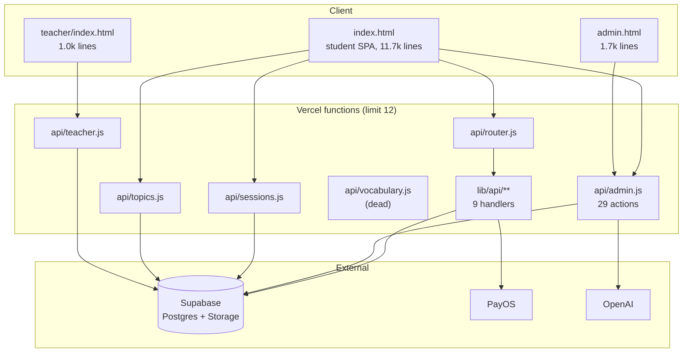
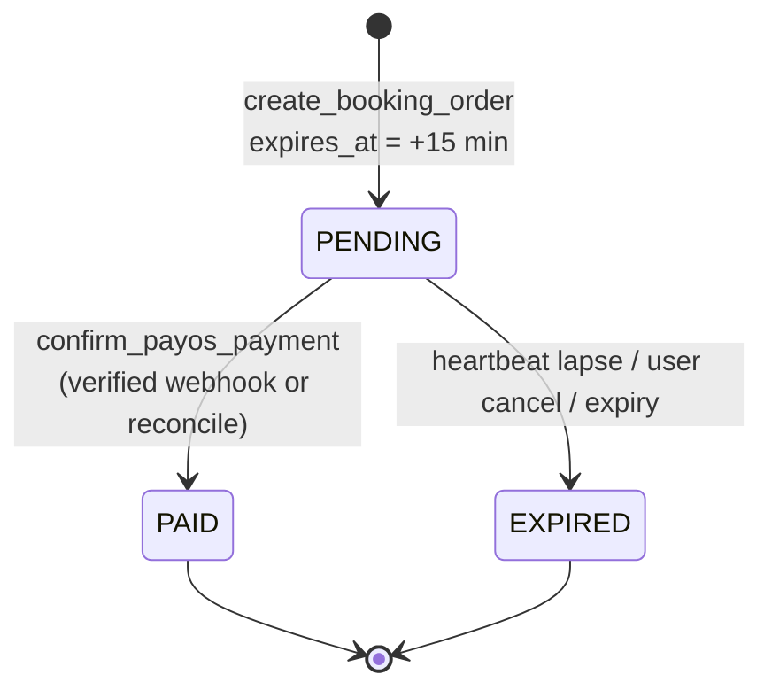

# Architecture — current state

Reverse-engineered from the code on 2026-08-16. There was no prior documentation; every
statement below cites `file:line` so it can be re-verified.

## 1. Shape of the system

Static HTML pages plus Vercel serverless functions, backed by Supabase. No build step, no
framework, no bundler. The three HTML files are served as-is.

### The 12-function constraint

Vercel's plan caps the project at 12 serverless functions. Two consequences shape the
whole layout and must be understood before adding anything:

1. `api/router.js` multiplexes nine logical endpoints into one function. `vercel.json`
   rewrites `/api/bookings/create` to `/api/router?group=bookings&action=create`, and
   `api/router.js:11-21` dispatches to `lib/api/**`. Files under `lib/` are not functions.
2. `api/admin.js` hosts **both** admin actions and public student actions (placement,
   progress, chat, community, notifications, price) for the same reason — hence 2,766 lines
   in one file and a 29-branch dispatcher at `api/admin.js:2688-2752`.

Current count: 6 functions in `api/` (`admin`, `router`, `sessions`, `teacher`, `topics`,
`vocabulary`). CI fails if this exceeds 12.

## 2. Request routing

| Public path | Function | Notes |
|---|---|---|
| `/` | `index.html` | student SPA |
| `/admin` | `admin.html` | `vercel.json` rewrite |
| `/teacher` | `teacher/index.html` | `vercel.json` rewrite |
| `/api/bookings/{create,reschedule}` | `api/router.js` → `lib/api/bookings/*` | |
| `/api/customers/{login,history}` | `api/router.js` → `lib/api/customers/*` | |
| `/api/orders/{status,cancel}` | `api/router.js` → `lib/api/orders/*` | |
| `/api/payos/{create,reconcile,webhook}` | `api/router.js` → `lib/api/payos/*` | |
| `/api/admin?action=…` | `api/admin.js` | 29 actions, 14 of them unauthenticated |
| `/api/sessions?from=&to=` | `api/sessions.js` | public timetable |
| `/api/topics?action={open,file}` | `api/topics.js` | gated by paid booking |
| `/api/teacher?action=…` | `api/teacher.js` | 6 actions |
| `/api/vocabulary` | `api/vocabulary.js` | **dead code**, no caller |

All handlers use the Web-standard signature `export default { async fetch(request) }`.

### The authentication gate is positional

`api/admin.js` checks admin auth at line 2723. Every `action` compared **before** that line
is reachable by anyone; everything after requires a bearer token. The ordering of one `if`
statement is the entire boundary. The intended public set is recorded in
`.github/public-actions.txt` and enforced by CI.

## 3. Where the business logic actually lives

**Most correctness-critical logic is not in this repository.** It is implemented as Postgres
functions inside Supabase. JavaScript validates input, calls an RPC, and maps error codes.

| RPC | Called from | Owns |
|---|---|---|
| `create_booking_order` | `lib/api/bookings/create.js:176` | price, seat locking, `expires_at` hold, `SESSION_FULL` / `ALREADY_BOOKED` |
| `confirm_payos_payment` | `lib/api/payos/webhook.js:77`, `reconcile.js:175` | PENDING → PAID/CONFIRMED |
| `reschedule_booking` | `lib/api/bookings/reschedule.js:34` | quota, 24h cutoff, program match |
| `get_public_sessions` | `api/sessions.js:154` | remaining seats |
| `verify_teacher_login` | `api/teacher.js:158` | teacher password check |

Committing these to `supabase/` is tracked as the highest-priority issue in the backlog.

## 4. Data model

22 tables plus one storage bucket, inferred from usage:

**Commerce** `customers` · `orders` · `payments` · `bookings` · `class_date_discounts` · `pricing_config`
**Scheduling** `class_sessions` · `programs` · `rooms` · `teachers` · `teacher_accounts` · `attendance_log` · `session_events`
**Assessment** `placement_tests` · `progress_tests` · `test_attempts`
**Engagement** `community_posts` · `community_likes` · `community_comments` · `support_messages` · `notification_reads` · `website_visits`
**Storage** bucket `topics` — `<date>-<program>-<title>.pdf`, plus `<folder>-pages/*.jpg` and `manifest.json`

### Known modelling quirks

- **Duplicate session rows.** One logical class can exist as several `class_sessions` rows
  sharing `teacher_id`, `program_id`, `session_date`, `starts_at`, `ends_at`. The teacher API
  compensates by fanning out over "equivalent sessions" (`api/teacher.js:286-295`,
  `:438-450`), and topic uploads write to all of them (`api/admin.js:1270`). This is a data
  defect being worked around in application code.
- **Identity resolution by phone tail.** `lib/api/customers/history.js:52-104` scans up to
  2,000 paid bookings and correlates them by normalised phone, because manually created
  bookings may not share the customer's `user_id`.
- **`session_events` has no writer.** Only read at `api/admin.js:2324` and `:2538`.

## 5. Booking and payment lifecycle

Three state columns move together: `orders.payment_status` (PENDING → PAID | EXPIRED),
`orders.order_status` (PENDING → CONFIRMED | CANCELLED), `bookings.status` (PENDING →
CONFIRMED | CANCELLED).

### Hold timing

| Constant | Value | Location |
|---|---|---|
| Hard expiry | 15 min (`expires_at`) | set in `create_booking_order` |
| Client heartbeat | 20 s | `index.html:7357` |
| Away-release | 60 s hidden tab | `index.html:7358` |
| Server grace | 75 s since `hold_last_seen_at` | `lib/api/payos/create.js:41-47`, `reconcile.js:40-44` |

Expiry is **opportunistic**: there is no cron. A hold is released when a request touches it
or when seat availability is recomputed. `vercel.json` declares no `crons`.

### Payment confirmation has two paths

1. **Webhook** — `lib/api/payos/webhook.js:23` verifies the PayOS HMAC signature, then calls
   `confirm_payos_payment`.
2. **Reconcile** — the client polls `/api/orders/status` every 2.5 s and calls
   `/api/payos/reconcile`, which queries PayOS `/v2/payment-requests/{orderCode}` server-side
   and requires `amountPaid >= order.total_amount` (`reconcile.js:166`).

Price is never accepted from the client: the browser sends only `{ phone, full_name, session_ids }`
(`lib/api/bookings/create.js:154-157`); totals and date discounts are computed server-side
(`create.js:44-123`).

There is **no refund or reversal path** anywhere in the codebase.

## 6. Authentication model

| Surface | Mechanism | Lifetime | Location |
|---|---|---|---|
| Student | phone number only → `customers.device_token` | never expires, never rotates | `lib/api/customers/login.js:80-115` |
| Admin | shared password → HMAC bearer | 8 h | `api/admin.js:10-37` |
| Teacher | username + password via RPC → HMAC bearer | 12 h | `api/teacher.js:53-115` |
| Topic files | signed Supabase Storage URL | 10 min | `api/topics.js:55-71` |

All tokens live in `localStorage`. Every backend handler uses the Supabase **service-role**
key, so Row Level Security is never evaluated and authorization exists only as JavaScript
checks inside each handler. Details and severities are in the private security advisories.

## 7. AI pipelines

**Placement test** — reading MCQs scored in-process, plus two speaking prompts:
audio → `placement-transcribe` (`api/admin.js:1445`, `OPENAI_TRANSCRIBE_MODEL`) →
`placement-score` (`api/admin.js:1569`, `OPENAI_PLACEMENT_MODEL`, strict JSON schema
`speakhub_placement_result`) → `placement_tests`. Pronunciation is a blend: 65 % model
judgement, 35 % transcription log-prob confidence (`api/admin.js:1762`). Program
recommendation is age-bounded (`api/admin.js:1614`).

**Progress test** — same transcription endpoint, scored by `progress-score`
(`api/admin.js:1952`), requires an authenticated customer and a confirmed booking,
upserts `progress_tests` keyed by `(customer_id, booking_id)`.

**Topic vocabulary** — `generateTopicVocabulary` (`api/admin.js:1090`) produces 10 structured
items under a strict schema during admin PDF upload, written to
`class_sessions.topic_vocabulary` and read by all three frontends.

Quotas are 3 attempts per day, counted in `test_attempts`. For guests the counter key is
supplied by the client.

## 8. Topic material pipeline

1. Admin uploads a PDF (`admin.html:1671` → `api/admin.js:1198`).
2. The **browser** renders every page with PDF.js onto a canvas at 1600 px and uploads JPEGs
   at quality 0.82 (`admin.html:1646-1661` → `api/admin.js:1171`). Rendering is client-side;
   the server only stores.
3. On the last page the server writes `manifest.json`.
4. Students receive 10-minute signed URLs for the images, falling back to the PDF
   (`api/topics.js:55-71`); teachers get the raw PDF streamed (`api/teacher.js:464`).

## 9. Operational characteristics

- **No scheduled work at all.** No cron, no queue, no background job. Everything happens
  inside a request.
- **No outbound messaging.** No SMS, email, Zalo or push. `action=reminders` produces a
  dashboard list for manual phone calls.
- **Retry shim.** `runAdminActionWithRetry` (`api/admin.js:2667`) retries once after 1.2 s on
  Supabase `PGRST303` clock-skew errors.
- **Caching.** Seat data is `no-store` (`api/sessions.js:187`); topic responses are
  `private, max-age=120`.
- **Observability.** `console.log`/`console.error` into Vercel logs only. No error tracker,
  no metrics, no alerting, no uptime check.
- **Tests.** None.

## 10. Environment variables

`SUPABASE_URL` · `SUPABASE_SECRET_KEY` · `SUPABASE_PUBLISHABLE_KEY` ·
`SPEAKHUB_ADMIN_PASSWORD` · `SPEAKHUB_ADMIN_SECRET` · `SPEAKHUB_TEACHER_SECRET` ·
`PAYOS_CLIENT_ID` · `PAYOS_API_KEY` · `PAYOS_CHECKSUM_KEY` · `PUBLIC_APP_URL` ·
`OPENAI_API_KEY` · `OPENAI_PLACEMENT_MODEL` · `OPENAI_TRANSCRIBE_MODEL`

See `.env.example`. `SPEAKHUB_TEACHER_SECRET` silently falls back to `SPEAKHUB_ADMIN_SECRET`
and then to `SUPABASE_SECRET_KEY` (`api/teacher.js:42-49`) — always set it explicitly.

## 11. Fault lines

Ranked by how much they will cost the next change:

1. **The database is not in the repo.** Five RPCs decide prices and seat availability, and
   cannot be reviewed, tested or rolled back.
2. **`index.html` is a single 11,754-line file** carrying dead prototype code and duplicated
   logic; every edit risks unrelated breakage.
3. **Authorization is hand-written in every handler** with no RLS backstop.
4. **No scheduled execution**, so hold expiry, reminders and recurring sessions all depend on
   someone triggering a request.
5. **No tests and no staging environment**; production is the only place anything is verified.
6. **Duplicate `class_sessions` rows** are worked around in three separate code paths.
