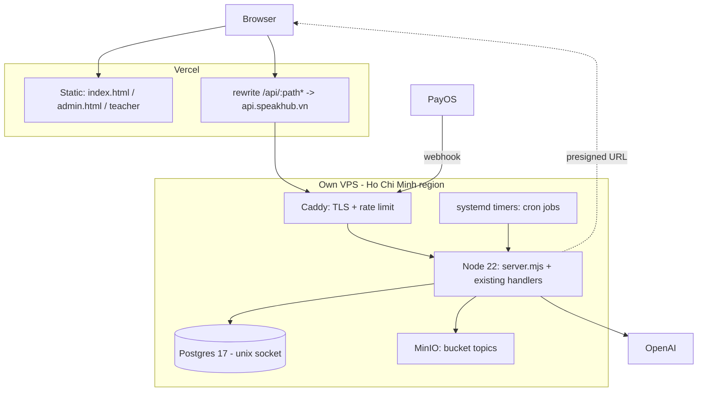

# Migration off Supabase to a self-hosted server

- **Status:** planned, not started
- **Date:** 2026-08-16
- **Decision record:** [`adr/0006-move-off-supabase-to-self-hosted-postgres.md`](adr/0006-move-off-supabase-to-self-hosted-postgres.md)
- **Supersedes parts of:** [`ARCHITECTURE-TARGET.md`](ARCHITECTURE-TARGET.md) phases 3, 4 and 6

## Goal

Move persistence and API execution onto infrastructure the project owns:

- Postgres on our own VPS, reached over a local unix socket, not the public internet.
- MinIO on the same VPS for the `topics` bucket.
- The existing `/api/*` handlers running as one long-lived Node process on that VPS.
- Static pages continue to be served by Vercel; the browser keeps calling same-origin `/api/*`.

Supabase is decommissioned at the end. Nothing about the product's behaviour changes.

## Non-goals

| Not doing | Why |
|---|---|
| Framework or bundler migration | Unrelated to persistence; ADR 0001 still holds for the frontend |
| ORM or query builder | The five RPCs stay the business-logic boundary; the rest is short SQL |
| Docker Swarm / Kubernetes | One venue, one server; systemd is the correct weight |
| Rewriting handler HTTP logic | Measured below: handlers use zero Vercel-specific API |
| Changing the payment provider or its flow | The verified HMAC webhook path is the least safe thing to touch |
| Dual-write / zero-downtime cutover | Costs more risk than a 45-minute night window buys (see Phase 6) |

## What actually couples this codebase to Supabase

Measured on 2026-08-16 at commit `6b1165c`:

| Coupling | Count | Where the work is |
|---|---|---|
| `supabase.from(...)` query chains | **167** | `api/admin.js` alone has **118 (71%)** |
| Postgres RPC calls | 5 | 4 via `supabase.rpc`, 1 via raw REST in `api/sessions.js:154` |
| `supabase.storage.from('topics')` ops | 12 | `api/admin.js` 7, `api/topics.js` 3, `api/teacher.js` 1, `+1` |
| `supabase.auth.admin.*` | 4 | `lib/api/customers/login.js`, `api/admin.js:807` |
| Raw PostgREST `fetch` | 2 | `api/sessions.js:7`, `api/sessions.js:154` |
| Tables | 23 | `class_sessions` 27 refs, `bookings` 22, `orders` 15, `customers` 15 |
| RLS policies to port | **0** | none are enabled today |

Per-file, so the ordering is not guesswork:

| File | lines | `.from(` | `.rpc(` | storage |
|---|---:|---:|---:|---:|
| `api/admin.js` | 2766 | 118 | 0 | 7 |
| `api/teacher.js` | 554 | 19 | 1 | 1 |
| `api/topics.js` | 127 | 6 | 0 | 3 |
| `api/sessions.js` | 199 | 0 (raw REST) | 1 (raw REST) | 0 |
| `lib/api/payos/reconcile.js` | 250 | 6 | 1 | 0 |
| `lib/api/bookings/create.js` | 232 | 4 | 1 | 0 |
| `lib/api/customers/history.js` | 183 | 3 | 0 | 0 |
| `lib/api/payos/create.js` | 152 | 3 | 0 | 0 |
| `lib/api/payos/webhook.js` | 152 | 1 | 1 | 0 |
| `lib/api/customers/login.js` | 124 | 2 | 0 | 0 |
| `lib/api/orders/cancel.js` | 57 | 3 | 0 | 0 |
| `lib/api/bookings/reschedule.js` | 65 | 1 | 1 | 0 |
| `lib/api/orders/status.js` | 56 | 1 | 0 | 0 |
| `api/vocabulary.js` | 107 | 0 | 0 | 0 |

PostgREST-specific syntax that must become SQL: 5 embedded relations
(e.g. `customers:user_id(full_name,phone,status)` at `api/admin.js:114`), 5 `upsert` with
`onConflict`, 17 `count:'exact'` + `head:true` pairs, 37 `maybeSingle()`, 13 `single()`.

## Three measurements that make this cheaper than it looks

**1. The business logic is Postgres, not Supabase.** `create_booking_order`,
`confirm_payos_payment`, `reschedule_booking`, `get_public_sessions` and
`verify_teacher_login` are plain Postgres functions. Seat allocation, the 15-minute hold,
payment idempotency, reschedule quota and the 24-hour cutoff all live inside them. They move
by `pg_dump` and run unchanged. The hardest part of the system is the easiest part of this
migration — and it is why this migration is viable at all.

**2. Supabase Auth is vestigial.** Nothing verifies a GoTrue token anywhere:
`auth.getUser`, `access_token`, `auth.uid()` return zero hits across `api/` and `lib/`. The
only reason `supabase.auth.admin.createUser` exists is the FK from `customers.id` to
`auth.users(id)`, stated in the comment at `lib/api/customers/login.js:35-36`. Real auth is
the `device_token` column and hand-rolled HMAC tokens. Dropping GoTrue is: remove the FK,
generate the UUID with `gen_random_uuid()`, delete 4 call sites.

**3. The handlers are not Vercel-specific.** Zero hits for `@vercel/*`,
`process.env.VERCEL`, `waitUntil`, `export const config` or `runtime:`. Every handler is
`export default { async fetch(request) }` using web-standard `Request`/`Response`/`URL`, plus
`node:crypto` and `qrcode`. Node 22 provides all of those globally, so the same files run on
the VPS behind a ~40-line adapter — no HTTP-layer rewrite, and the same file serves both
platforms during cutover.

## Target topology



The browser still calls relative `/api/*` — verified: `index.html`, `admin.html` and
`teacher/index.html` contain zero absolute API URLs and zero `supabase` references. Vercel
rewrites proxy those paths to the VPS, so **there is no CORS work and no frontend change**.

## The cutover lever

`vercel.json` rewrites are per-path. That gives a per-endpoint canary with a one-line
rollback:

```json
{ "source": "/api/sessions", "destination": "https://api.speakhub.vn/api/sessions" }
```

Move one route at a time; if it misbehaves, revert that single line and the route is back on
Vercel + Supabase within a deploy. Payment routes move last, and only after everything else
has run in production for a full week.

## Phases

Ordered by risk removed per unit of work. Each phase ships on its own and states how it is
verified and how it is undone.

### Phase 0 — Get the schema out of Supabase *(blocks everything)*

Already tracked as issue #13; this migration makes it hard-blocking rather than merely
important.

- `pg_dump` schema and data. Required flags: `--no-owner --no-privileges`, and
  `--exclude-schema` for `auth`, `storage`, `graphql`, `graphql_public`, `realtime`,
  `supabase_functions`, `_realtime`, `extensions`, `vault`, `pgbouncer`, `net`, `cron`.
- Confirm the source Postgres major version (`select version()`) — the VPS must match it, or
  the restore is an upgrade and not a copy.
- Keep only the extensions actually needed. Expect `pgcrypto` (for `gen_random_uuid`) and
  possibly `uuid-ossp`; drop the Supabase-only ones.
- Strip references to roles that will not exist: `anon`, `authenticated`, `service_role`,
  `supabase_admin`. Any `SECURITY DEFINER` function must be re-owned to our app owner role and
  given an explicit `search_path`.
- Land the result as `db/migrations/0001_baseline.sql` plus one migration per subsequent
  change, and a `db/apply.mjs` runner that records applied filenames in a `schema_migrations`
  table.
- Write down each RPC's signature and every error code it raises; the handlers branch on those
  strings.

**Verification:** restore the dump into a throwaway local Postgres, then diff
`pg_dump --schema-only` of source and target until the only differences are the deliberate
exclusions.
**Rollback:** none needed; nothing in production changes.
**Blocked on:** Supabase database credentials, or a dump produced by you.

### Phase 1 — VPS baseline and staging database — **partly done 2026-08-17**

The target host turned out to be Ventra Server 1 (`ventra-pc`): Ubuntu 26.04, i3-8100,
**3.4Gi RAM shared with a live crawler pipeline**, 914G **HDD**, no `node`/`npm`/`nginx` on the
host, everything in Docker, ingress only through an existing Cloudflare Tunnel. That replaces
the systemd + apt + Caddy shape assumed when this plan was written; the stack, scripts and
runbook live in [`ventra-rocket/speakhub-infra`](https://github.com/ventra-rocket/speakhub-infra).

Done and verified on the host:

- `nginx` proxy on `127.0.0.1:8080`, app container, and **Postgres 17 with no published port**.
  Docker writes iptables directly and bypasses `ufw`, so loopback-only publishing is enforced
  by the compose file and asserted by `ops/verify.sh`.
- The three roles, with `speakhub_app` confirmed `NOBYPASSRLS` — the precondition for Phase 7.
- Memory ceilings 64m + 320m + 512m; measured usage **136MB**; logs capped at 10m × 3 files.
- The six pre-existing containers and the `ufw` rule count are asserted unchanged after deploy.

Not done, and why:

- **MinIO deferred to Phase 4.** Presigned URLs embed the host that signed them and MinIO does
  not support a path prefix, so exposure needs its own hostname or an app-side download proxy.
  That is the storage layer's decision, not the baseline's.
- **Backups not yet configured.** There is nothing to back up until the dump lands, and a
  backup script whose restore has never been rehearsed is worse than none. Blocks Phase 6.
- **Staging database is empty**, pending Phase 0. The Postgres major version may still need to
  change to match the source.
- **No public hostname yet:** `speakhub.vn` is on Mắt Bão nameservers, so a tunnel hostname is
  impossible until the zone moves to Cloudflare — an owner action. See the infra runbook.

**Rollback:** `docker compose down` in `/srv/apps/speakhub-staging`; nothing else on the host is
affected.

### Phase 2 — Run the existing handlers on Node, still against Supabase — **done 2026-08-17**

The de-risking step: prove the transport layer works before changing the data layer.

`server.mjs` in the app repo hosts the unmodified handlers, mirrors the `vercel.json` route
table including the `group`/`action` parameters its rewrites inject, and imports every handler
eagerly so a missing environment variable stops the process instead of producing a 500 per
request. The `Self-host route parity` CI job fails if a rewrite is added without a route.

One defect this surfaced, absent on Vercel: Vercel serves only build output, but a self-hosted
process serves a working copy, so an unguarded static handler answers `GET /.env.local`. Static
resolution now denies dotfiles at any depth, `api/`, `lib/`, `node_modules/`, `docs/`, `.git/`,
`*.mjs` and the dependency manifests. Verified both locally and on the host.

**Verified on the host:** the three pages return 200 and render with zero broken images and
zero JS errors; `/package.json`, `/.env.local`, `/assets/../package.json`, `/server.mjs`,
`/.git/config` and `/lib/api/customers/login.js` all return 403; a POST with an invalid phone
reaches the handler and returns `INVALID_PHONE`; a 30MB body is refused with 413; and
`/api/admin?action=login` returns 401 for a wrong password and a signed HMAC token for the
staging password — end-to-end proof of environment wiring without any database.
**Rollback:** stop the process; Vercel is untouched and still serves production.

### Phase 3 — Data-access layer, ported handler by handler

- `lib/db/pool.mjs`: one `pg` `Pool` for the process, socket connection, statement timeout.
- `lib/db/sql.mjs`: parameterised query helpers matching the shapes the handlers already
  need — `one()`, `oneOrNone()` (the 37 `maybeSingle()` and 13 `single()` sites),
  `many()`, `count()` (the 17 `count:'exact'`/`head:true` pairs), `tx()` for real
  transactions, and `upsert()` for the 5 `onConflict` sites.
- Port order — least dangerous first, money last:
  1. `api/sessions.js` — 0 chains, just call the RPC directly (drops the raw PostgREST fetch)
  2. `api/topics.js`, `api/vocabulary.js` *(the latter is being deleted anyway, issue #9)*
  3. `lib/api/orders/status.js`, `cancel.js`, `lib/api/customers/history.js`
  4. `lib/api/customers/login.js`
  5. `api/teacher.js`
  6. `api/admin.js` — 118 chains; split by tab (overview, sessions, customers, bookings,
     discounts, topics, chat) so each is a reviewable PR
  7. `lib/api/bookings/*`, then `lib/api/payos/*` **last**
- The 5 embedded relations become explicit `JOIN`s. The RPC calls become `select * from fn(...)`
  and keep their error strings, so no handler branch changes.

**Verification:** a parity harness, `db/parity/`, runs the same input set against Supabase and
the VPS database and diffs normalised JSON. This is the substitute for the test suite the
project does not have (ADR 0005), and it is throwaway code — it dies with Supabase.
**Rollback:** per-handler; both code paths exist until the file is ported.

### Phase 4 — Storage to MinIO

- `lib/storage.mjs` over the S3 SDK, exposing the five operations actually used:
  `upload`, `download`, `list`, `remove`, `presign`. Maps 1:1 onto the 12 call sites.
- Keep the current semantics exactly: private bucket, 600-second presigned URLs, the
  `topic-images/<hash>/manifest.json` layout and `cacheControl: 3600`.
- Copy objects with `mc mirror`, verify by count and checksum, then flip a single env var.

**Verification:** a student opens a topic PDF and every rendered page image on staging; the
teacher app streams the same PDF; admin re-uploads a PDF and the manifest regenerates.
**Rollback:** flip the env var back; objects stay in both places until Phase 8.

### Phase 5 — Delete Supabase Auth

- Drop the `customers.id → auth.users(id)` FK, default the column to `gen_random_uuid()`.
- Delete the 4 `auth.admin` call sites and the synthetic `login-<phone>-<hex>@speakhub.local`
  email hack.
- Keep the race-safety behaviour from `login.js:68-81`, but express it correctly as
  `insert ... on conflict (phone) do nothing` + re-select, which is what that code was
  emulating.

**Verification:** a brand-new phone number creates exactly one customer under 20 concurrent
identical requests; an existing phone never creates a second row.
**Rollback:** the migration is reversible while Supabase still holds the old rows.

### Phase 6 — Production cutover, and Vercel is retired with it

> **Amended 2026-08-17** by [ADR 0007](adr/0007-retire-vercel-and-self-host-the-frontend.md).
> The product owner dropped Vercel entirely, so this phase no longer repoints `vercel.json`
> rewrites at the server — it moves the origin itself and ends with the Vercel project deleted.
> `server.mjs` already serves the pages, so this is a DNS and readiness exercise, not new code.

**Before the window — DNS, which is a prerequisite and not part of the cutover.** The
`speakhub.vn` zone moves onto Cloudflare nameservers with its records byte-identical to today,
so Vercel keeps serving throughout. The zone must land in the **same** Cloudflare account as
the tunnel: a CNAME to `cfargotunnel.com` from a different account is refused with Error 1014.
`speakhub-infra/ops/dns-cutover.sh` captures the current zone, then rehearses the new one
against Cloudflare's own nameservers *before* the registrar is touched, because a Cloudflare
zone answers on its assigned nameservers while the old ones are still authoritative. Rollback
is pointing the nameservers back at Mắt Bão.

**Also before the window — the host has to deserve production traffic.** ADR 0007 lists the
preconditions with their measurements: backups with a rehearsed restore, Postgres on the SSD
rather than the spinning disk, a UPS, a stated RAM budget that cannot OOM the crawler, edge
cache rules that cover the landing page but never `/admin` or `/teacher`, and the two
host-level security findings closed. None of these are follow-ups; the host holds the payment
record after this phase.

Then the window itself:

1. Announce a 45-minute window at a genuinely dead hour. There is no dual-write; the window
   is the whole plan.
2. Freeze writes: put the booking and payment routes behind a maintenance response.
3. Final `pg_dump` → restore → row-count and checksum comparison per table.
4. Point the apex and `www` at the tunnel as proxied records, reads verified before writes are
   unfrozen. TTLs stay short until the cutover has held for a week.
5. Move the PayOS webhook URL last. In-flight payments during the window are covered by PayOS
   retries **and** by the existing `payos:reconcile` endpoint — verify both after the flip.
6. Watch for one week with Supabase still live and untouched as the rollback target, and with
   the Vercel deployment still built and reachable by its `*.vercel.app` hostname.
7. Only then delete the Vercel project and `vercel.json`. `server.mjs` becomes the route
   contract and the `Self-host route parity` CI job inverts to check it directly.

**Verification:** run the full manual flow on production — book → hold → PayOS → confirm →
topic PDF → reschedule → attendance → admin overview — plus a real paid booking of the
smallest amount, and reconcile it. Then `ops/dns-cutover.sh after` with `EXPECT=tunnel`, which
fails if any record from the baseline was lost in the move.
**Rollback:** DNS back to the Vercel records, which is why the Vercel project is deleted a week
late and not on the day. Any writes that landed on the server during an incident must be
replayed by hand, which is exactly why payment routes move last.

### Phase 7 — Capabilities that only exist after the move

These are already-open issues that the current platform blocks, not new scope:

- **Scheduled execution** (issue #14, #16 — supersedes target Phase 4): systemd timers hitting
  local endpoints. Expire stale holds, materialise recurring sessions, T-24h reminders, sweep
  abandoned PENDING orders. `api/sessions.js:30`'s dead `materializeRecurringSessions` is
  deleted rather than revived.
- **RLS as a real backstop** (issue #4 — supersedes target Phase 3): with `speakhub_app` as a
  `NOBYPASSRLS` role, policies finally mean something. Under Supabase's service-role key they
  could not.
- **No more 12-function ceiling:** `api/router.js` exists only to dodge that limit. Handlers
  can be split by domain again, and the CI function-count gate is replaced by a route-table
  check.
- **Tests become possible:** CI can start a real Postgres, apply `db/migrations/*` and exercise
  the RPCs. This was impractical against a hosted Supabase project and is the first honest
  path off ADR 0005.

### Phase 8 — Decommission

- Remove `@supabase/supabase-js`; delete `SUPABASE_*` from `.env.example` and Vercel.
- Rotate every key that ever lived in Supabase, including the service-role key that is
  currently used by every handler.
- Export a final archival dump, verify the restore, then delete the Supabase project.
- Update `ARCHITECTURE.md`, `DEVOPS.md`, `SECURITY.md`, mark ADR 0001 amended, delete
  `db/parity/`, and close this document as `Status: done`.

## Risk register

| Risk | Why it is real here | Mitigation |
|---|---|---|
| Single VPS is now a hard SPOF | Vercel + Supabase were two independent managed services | Off-VPS encrypted backups, rehearsed restore, uptime check on `/api/sessions`, documented rebuild path |
| Silent behaviour drift in 167 rewritten queries | No test suite exists to catch it | Parity harness diffing against Supabase; port order puts money last; PR-sized batches |
| `api/admin.js` is 71% of the work in one 2766-line file | Large diffs hide mistakes | Port per admin tab, one PR each, `CODEOWNERS` review required |
| Ops burden lands on one person | TLS renewal, disk, upgrades, backups now ours | systemd + Caddy auto-TLS, disk and backup alerts, runbook in `DEVOPS.md` before cutover |
| Extra network hop via the Vercel rewrite | Adds latency versus serving the API from the same origin | Measure in Phase 2; if it costs too much, serve the static pages from Caddy too and drop Vercel |
| Payment double-processing during cutover | Two databases briefly reachable | Write freeze during the window; `confirm_payos_payment` is already idempotent; reconcile after |

## What is needed from you before Phase 0 can start

1. Supabase DB credentials, or a `pg_dump` you produce yourself, plus the output of
   `select version()`.
2. VPS: region, specs, root access. For this workload 2 vCPU / 4 GB / 80 GB SSD is enough;
   Postgres and MinIO share the disk.
3. A hostname for the API (`api.speakhub.vn` is assumed throughout) and DNS control.
4. Confirmation that a 45-minute write freeze at night is acceptable, and which night.
5. Whether Supabase Storage currently holds anything besides the `topics` bucket.

Nothing in Phase 0 touches production, so work can begin as soon as item 1 exists.
